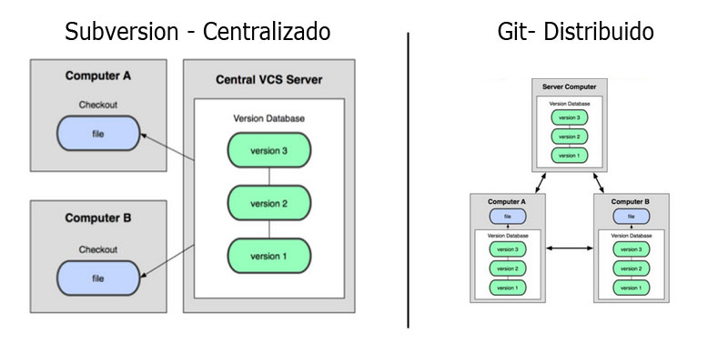

# Subversion vs Git

===================================================

<!-- START doctoc generado TOC por favor mantenga el comentario aquí para permitir la actualización automática ->
<!-- NO EDITE ESTA SECCIÓN, EN LUGAR RE-RUN doctoc PARA ACTUALIZAR -->

**Tabla de contenido**  *generado con: [DocToc](https://github.com/thlorenz/doctoc)*

- [Sistema Centralizado vs Sistema Distribuido](#sistema-centralizado-vs-sistema-distribuido)

<!-- END doctoc generó TOC por favor mantenga un comentario aquí para permitir la actualización automática -->

# Sistema Centralizado vs Sistema Distribuido

Subversion(sistema centralizado)  | Git(sistema distribuido).

**Sistema centralizado**

Subversion se basa en un sistema centralizado, la principal ventaja de un sistema centralizado es su simplicidad, pero por el contrario no nos permite tener más de un repositorio central sobre el que trabajar, no podemos realizar confirmaciones (commit) si no estamos conectados al repositorio central y si estamos trabajando en un equipo de trabajo con muchos usuarios, la colaboración se complica.

**Sistema distribuido**

En el caso de un sistema distribuido es posible trabajar sin conexión al repositorio central (trabajo offline), se facilita la colaboración, podemos tener tantos repositorios externos como queramos, la mayoría de las operaciones son locales por lo que el tiempo de ejecución de las mismas se reduce considerablemente y su instalación y configuración es muy sencilla en nuestro espacio de hosting.

